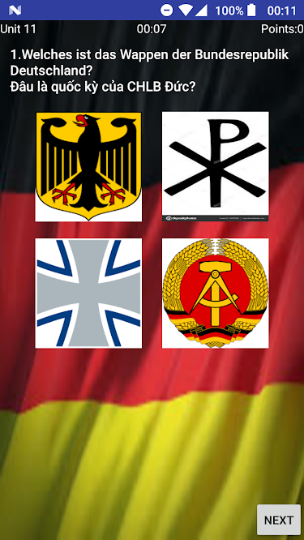

# einbuergerungstest-java
The Vietnamese-German bilingual test set includes 300 general questions and 160 state sentences, helping to practice and transfer to the Einbürgerungstest German citizenship exam or the "Leben in Deutschland" exam.

